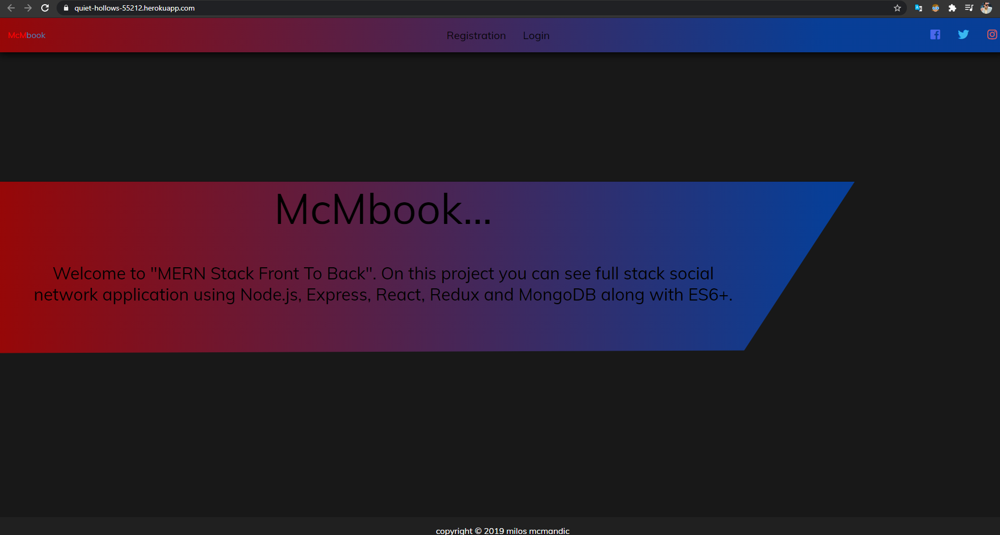

<h1>MERN Stack Front To Back</h1>

build an in depth full stack social network application using Node.js, Express, React, Redux and MongoDB along with ES6+. We will start with a blank text editor and end with a deployed full stack application. This course includes...

- Building an extensive backend API with Node.js & Express

- Protecting routes/endpoints with JWT (JSON Web Tokens)

- Extensive API testing with Postman

- Integrating React with our backend in an elegant way, creating a great workflow

- Building our frontend to work with the API

- Using Redux for app state management

- Creating reducers and actions for our resources

- Creating many container components that integrate with Redux

- Testing with the Redux Chrome extension

